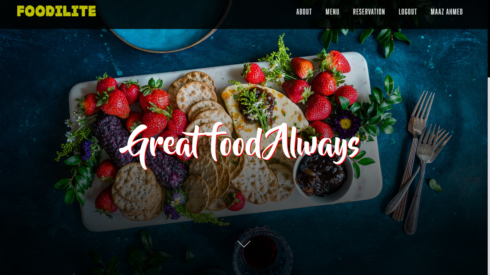
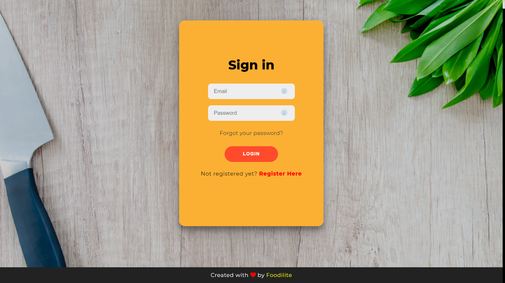
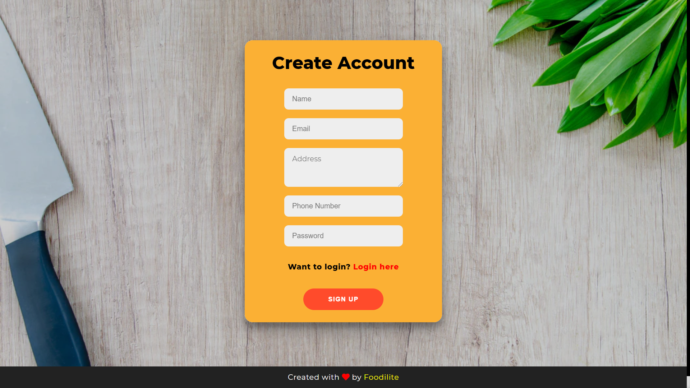
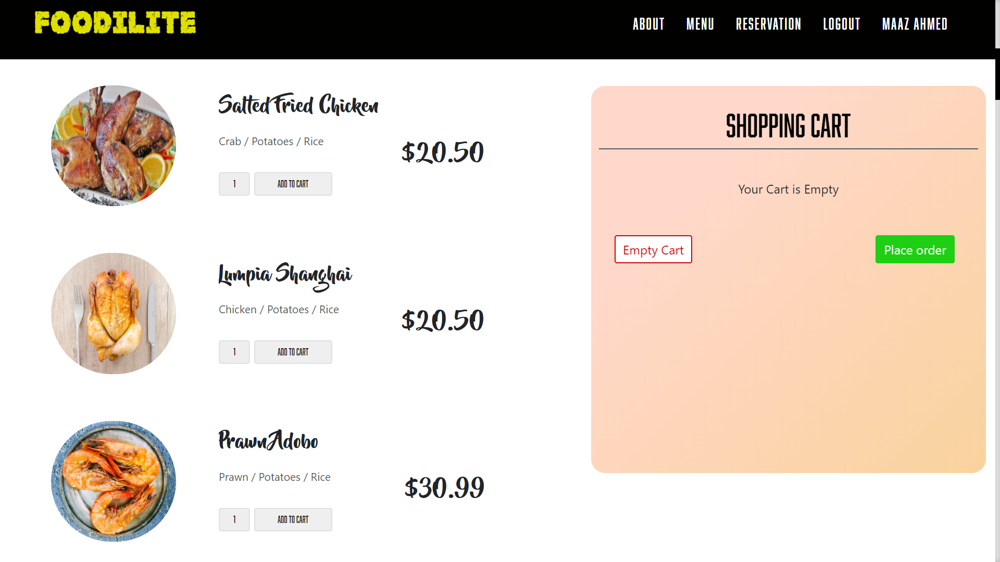
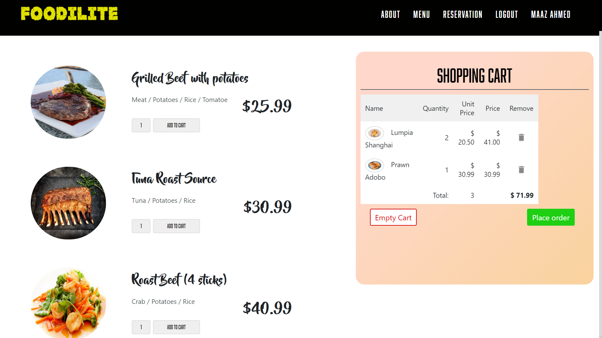
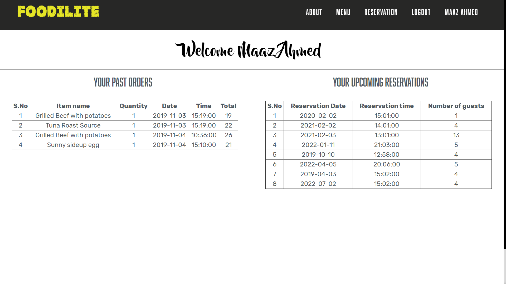

# Restaurant-Database-Management-System

This is a simple restaurant management system built for small and medium sized restaurants. The tech stack here is HTML for frontend, PHP for scripting and middleware and MySQL is used for relational database management.

## Languages and Technologies

 

## TODO

1. Admin section.
2. Code refactoring.
3. Improve UI.
4. Add more feature in menu and reservation section.
5. Improve Profile section and information.

## LANDING PAGE

  

## LOGIN PAGE

  

## SIGN-UP PAGE

  

## MENU

  

## CART

  

## RESERVATION PAGE

  

## USER PAGE

  

